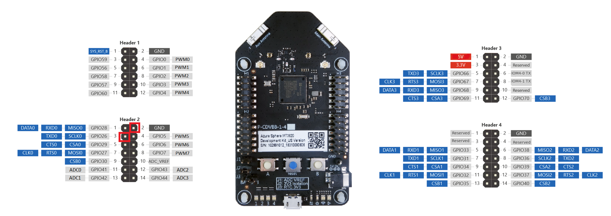
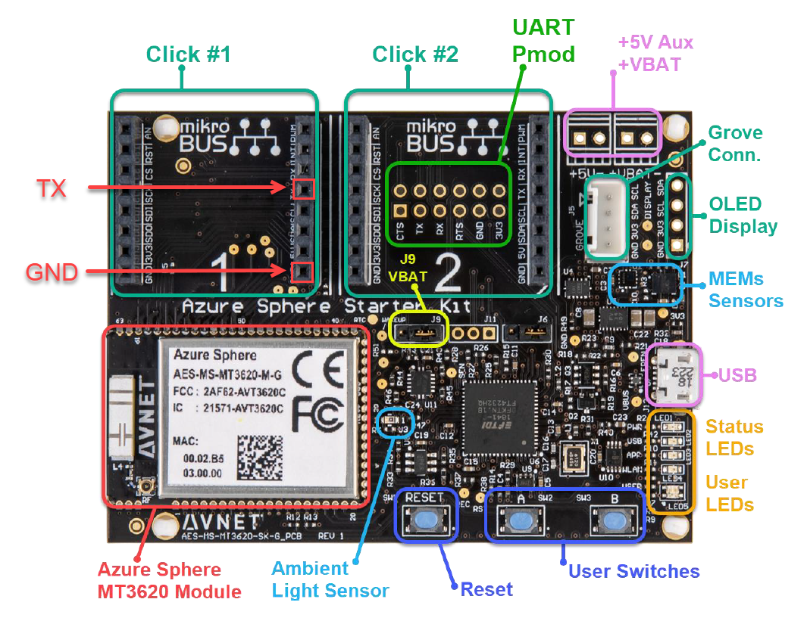
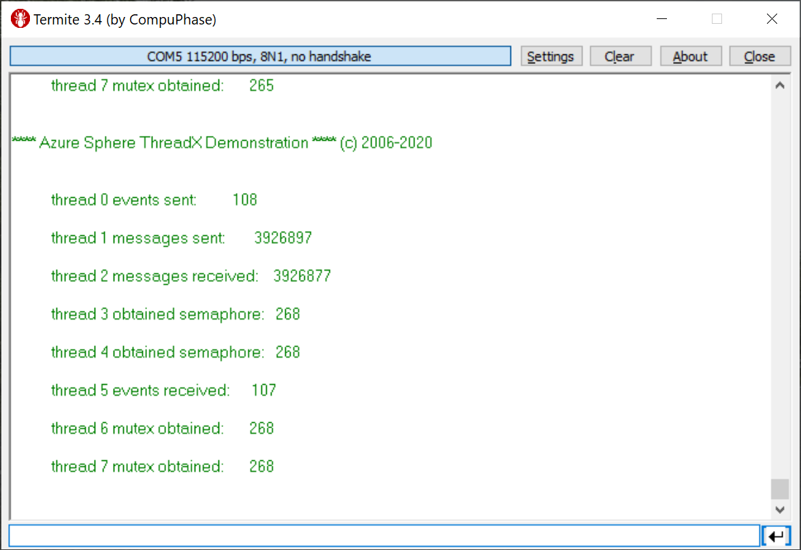

# Sample: MT3620 real-time capability application using Azure RTOS

This sample demonstrates how [Azure Sphere](https://azure.com/sphere) and [Azure RTOS](https://azure.com/rtos) are able to run together on MT3620 Development Kit.

This sample app for an MT3620 real-time core running Azure RTOS that creates several threads and repeatedly transmits message over a UART. These messages can be read in terminal application on a computer using a USB-to-serial adapter. By default, it uses the real-time core's dedicated UART, but if your hardware doesn't expose this UART's TX pin, then the sample can be altered to use a different UART.

To use this sample, clone the repository locally if you haven't already done so:

```bash
git clone --recursive https://github.com/Azure-Samples/Azure-RTOS-on-Azure-Sphere-Mediatek-MT3620
```

## Contents

| File/folder          | Description                                 |
| -------------------- | ------------------------------------------- |
| `demo_threadx`       | Sample source code.                         |
| `threadx`            | Azure RTOS ThreadX source code (submodule). |
| `mt3620_m4_software` | MediaTek 3620 HAL (submodule).              |
| `README.md`          | This README file.                           |

## Prerequisites

1. [Seeed MT3620 Development Kit](https://aka.ms/azurespheredevkits) or other hardware that implements the [MT3620 Reference Development Board (RDB) design](https://docs.microsoft.com/azure-sphere/hardware/mt3620-reference-board-design).

1. A USB-to-serial adapter (for example, [FTDI Friend](https://www.digikey.com/catalog/en/partgroup/ftdi-friend/60311)) to connect the real-time core UART to a USB port on your computer.

1. A terminal emulator (such as Telnet or [Termite](https://www.compuphase.com/software_termite.htm) to display the output.

## Prepare your device

To prepare your device on Windows:

1. Right-click the Azure Sphere Developer Command Prompt shortcut and select **More>Run as administrator**.

   The `--EnableRTCoreDebugging` parameter requires administrator privilege because it installs USB drivers for the debugger.

1. Enter the following azsphere command:

   ```cmd
   azsphere device enable-development --enablertcoredebugging
   ```

1. Close the window after the command completes because administrator privilege is no longer required. As a best practice, you should always use the lowest privilege that can accomplish a task.

To prepare your device on Linux:

1. Enter the following azsphere command:

   ```cmd
   azsphere device enable-development --enablertcoredebugging
   ```

You may need to update the OS by using if you have an older device.

```cmd
azsphere device recover
```

## Set up hardware to display output

To prepare your hardware to display output from the sample:

1. Attach the USB-to-serial adapter to your PC.

For Seeed RDB

1. Connect GND on the USB-to-serial adapter to GND on your dev kit. On MT3620 RDB hardware, GND is Header 2, pin 2.

1. Connect RX on the USB-to-serial adapter to TXD0 on your dev kit. On MT3620 RDB hardware, TXD0 is Header 2, pin 3.



For Avnet Azure Sphere Starter Kit

1. Connect GND on the USB-to-serial adapter to GND on your dev kit. On Avnet Azure Sphere Starter Kit hardware, GND is Click Socket #1, Header 2, pin 8.

1. Connect RX on the USB-to-serial adapter to TXD0 on your dev kit. On Avnet Azure Sphere Starter Kit hardware, TXD0 is Click Socket #1, Header 2, pin 4.



For Windows:

1. Determine which COM port the adapter uses on the PC. If you're using the FTDI Friend adapter, start **Device Manager**, select **View > Devices by container**, and look for FT232R USB UART.

1. On the PC, start a **terminal emulator** and then open a 115200-8-N-1 terminal to the COM port used by the adapter.

For Linux:

1. Find out which port the serial device is connected to:

   ```bash
   dmesg | grep ttyUSB
   ```

   The port should be named **ttyUSBn**, where n indicates the port number.

1. Set up a terminal program to monitor the port. For example, the following commands set up [Minicom](https://help.ubuntu.com/community/Minicom) to monitor port 5, but you can use any program you prefer:

   ```bash
   sudo apt install minicom

   sudo minicom -D /dev/ttyUSB5 -b 115200
   ```

## Build and run the sample

See tutorial to learn how to build and deploy this sample: [Tutorial: Build a real-time capable application](https://docs.microsoft.com/azure-sphere/install/qs-real-time-application?tabs=windows&pivots=visual-studio)

> Note: You need Azure Sphere SDK version >= 20.07 to build and run the sample.

## Observe the output

The connected terminal emulator should display output from the `demo_threadx` program. The program outputs the threads status incrementally:



## References

- [Install the SDK](https://docs.microsoft.com/azure-sphere/install/overview)
- [Claim your device](https://docs.microsoft.com/azure-sphere/install/claim-device)
- [Update the OS on an early dev kit](https://docs.microsoft.com/azure-sphere/resources/update-old-seeed-os)

## Contributing

This project welcomes contributions and suggestions. Most contributions require you to agree to a
Contributor License Agreement (CLA) declaring that you have the right to, and actually do, grant us
the rights to use your contribution. For details, visit https://cla.opensource.microsoft.com.

When you submit a pull request, a CLA bot will automatically determine whether you need to provide
a CLA and decorate the PR appropriately (e.g., status check, comment). Simply follow the instructions
provided by the bot. You will only need to do this once across all repos using our CLA.

This project has adopted the [Microsoft Open Source Code of Conduct](https://opensource.microsoft.com/codeofconduct/).
For more information see the [Code of Conduct FAQ](https://opensource.microsoft.com/codeofconduct/faq/) or
contact [opencode@microsoft.com](mailto:opencode@microsoft.com) with any additional questions or comments.
